# Centre d'aide en informatique

## Mise en situation

En l'an 2030 tous les techniciens informatique du cégep régional de Lanaudière à Joliette ont disparu. Le CAI doit maintenant s'occuper de tout (sans être payé bien sûr). Seras-tu capable de maintenir le système informatique du cégep et le ramener à sa gloire d'antan ou crouleras-tu sous la pression? En plus, les SIM essayent de te saboter pour que Philippe te renvoie et qu’ils prennent le contrôle de tout le système informatique du cégep. L’avenir du CAI dépend de toi!

## Concept

Le but du jeu est de survivre à 15 semaines d’enfer dans la classe de CAI (1 semaine = 1 quart de travail). Pour réussir un quart de travail, il faut accomplir assez de tâches pour atteindre la note de passage de cette journée. Si tu arrives à survivre aux 15 semaines qui deviennent graduellement plus compliquées, Philippe te donnera ton diplôme du CAI et tu pourras enfin aller à l’université. Mais, si tu échoues 3 semaines, Philippe sera forcé de te renvoyer et les SIM prendront ta place.

# Menu principal

Le joueur va apparaître devant un moniteur qui fera office de menu principal, il y aura le titre du jeu, le logo / bannière du jeu, un bouton pour commencer l’année, un bouton pour continuer une partie, un bouton pour quitter le jeu et un bouton pour aller dans les paramètres:

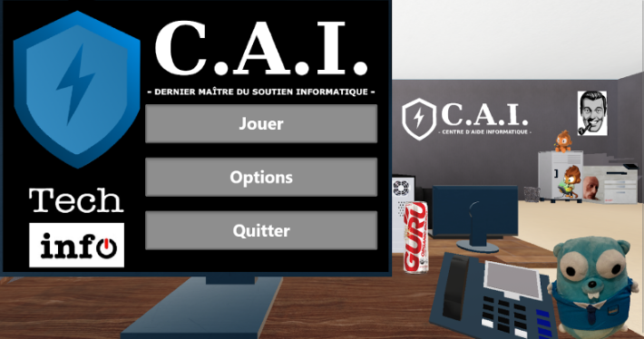

## Sauvegardes

Sur le menu principal, le joueur peut décider de recommencer à partir d’une sauvegarde. Lors d’un quart de travail, il peut décider de recommencer le quart, ce qui est en soit un chargement de l’ancienne sauvegarde:

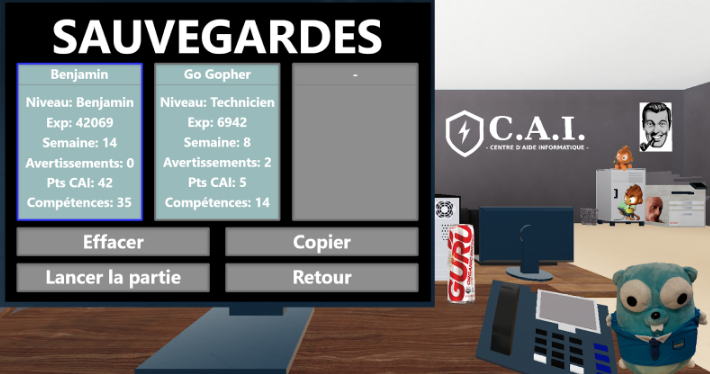

À la fin d’un quart de travail, le jeu s’enregistre automatiquement en sauvegardant:
- Les compétences débloqués
- Les quarts de travail achevés
- Les points d’expérience

## Options

Certaines options peuvent être paramétrées:

- V-Sync
- Plein écran
- Résolution

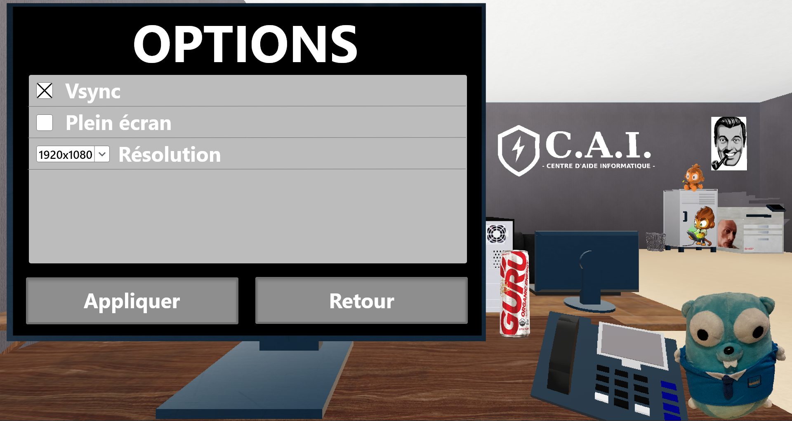

# Processus

Chaques semaine de jeu est constitué de 3 phases différentes qui se succéderont les uns après les autres, avant de recommancer la semaine suivante. La première partie est le pré-quart de travail, la seconde est le quart de travail et la dernière sera le post-quart de travail.

## Pré-quart de travail

- Philippe donne une séance d’information au joueur (Il peut aussi donner le tutoriel)
    - Montre les défis possibles
    - Événements à accomplir
- Lorsque le joueur accepte, le joueur se fait téléporter dans le niveau
    - Dépend de la difficulté, facile (jours 1 - 5) = C-220, moyen (jours 6 - 10) = c110, difficile (jours 11 - 15) = bibliothèque
- Le joueur peut s’asseoir à son bureau et améliorer ses compétences avec l’expérience qu’il gagne en accomplissant des tâches.
    - Améliorer ses stats à partir de l’arbre de compétence (plus vite réparation, court plus vite, rendre les mini-jeux plus simples, etc)
    - Mettre des choses sur son bureau (débloquer avec des achievements)?
- Lorsqu’il signe le petit papier ou lorsque 5 minutes se sont écoulées, il commence un quart de travail

<table><tr>
<td> 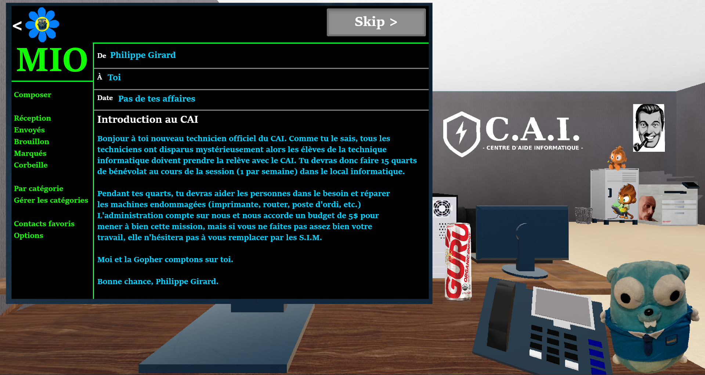 </td>
<td> 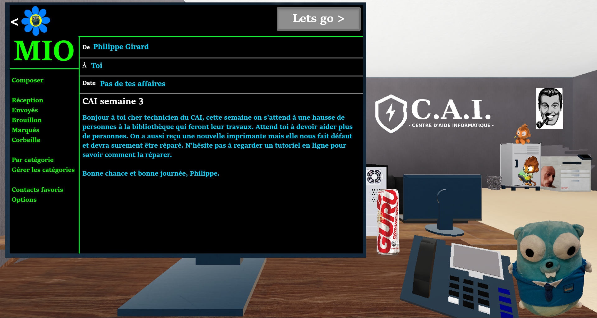 </td>
</tr></table>

## Quart de travail

- X nombre d’élèves vont entrer dans le local à différent interval
- Ils ont une barre de patience (bonhomme sourire au-dessus de leur tête ?) 
    - Détermine le temps qu’ils attendront dans la salle avant de quitter
    - Peut-être influencé par différents facteurs (odeur, compétence)
- Il y a aussi des objets qui pourront tomber en panne et devront être réparés (Routeur, imprimantes, postes de travail, périphériques) Réparer ces objets donnera des points CAI au joueur proportionnel à la difficulté de la réparation.

### Jauge CAI

Chaque quart de travail, le joueur a comme objectif de remplir la jauge CAI  jusqu’à la note de passage. Pour le remplir, il doit accomplir le plus de réparations possible. Les réparations donnent des points tout en dépendant de la longueur et de la complexité. Par exemple, une réparation simple nécessitant un clique sur un bouton d'interaction contribue moins qu’une réparation complexe qui nécessite le mini jeu de ligne de commandes.

- Si le joueur réussit un mini-jeu, la jauge CAI augmente proportionnellement à la difficulté de la tâche.
- Si le joueur échoue dans un mini-jeu, la jauge CAI ne change pas (c’est considéré comme une perte de temps pour le joueur).

### Points

À noter que les points sont arbitraires, les points précis vont être calculés lorsque les mécaniques du jeu sont implémenter.
- 100-200 points par réparation simple
    - 100 (facile)
    - 150 (moyen)
    - 200 (difficile)
- 500-1000 points par réparation complexe
    - 500 (facile)
    - 750 (moyen)
    - 1000 (difficile)

### Échappe

Pour éviter une défaite, le joueur peut s’échapper de la pièce. La réussite du mini jeu entraîne la réussite du quart avec la note de passage, mais le joueur ne peut pas s’échapper pour les deux prochains quarts de travail. Une défaite entraîne l’échec du quart avec aucun points d’expérience (principe du high risk high reward).

Voir éviter des interventions pour plus de détails.

## Post-quart de travail

Philippe t’envoie un MIO qui montre ton résultat de quart de travail:
- Nombre de réparations complété (simple et complex)
- Nombre d’expérience obtenu
- Une image de la barre de progression du joueur

### Réussite du quart

Lorsque le temps s’écoule et que le joueur a assez de points pour dépasser la note de passage, le quart de travail est réussi. Il reçoit donc des points d’expériences pour avoir réussi le quart. Si le joueur a rempli la barre de progression plus que la note de passage, il recevra davantage des points.

 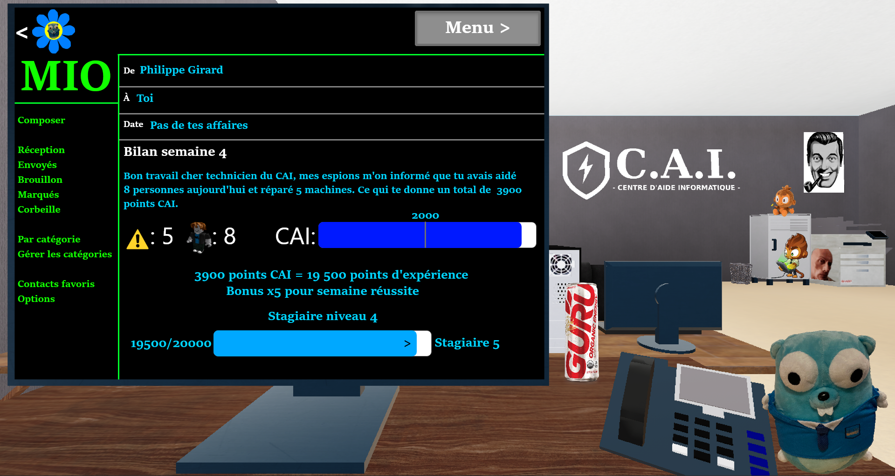

### Échec du quart

Si le temps s’écoule et que le joueur n’a pas obtenu la note de passage, il échoue le quart de travail et reçoit une prise. Il reçoit quand même des points d’expériences. Par la suite, le joueur peut recommencer le quart de travail pour réessayer à nouveau.

 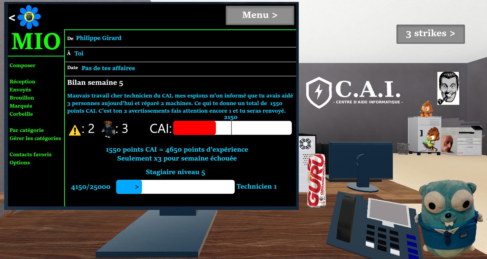
<table><tr>
<td> 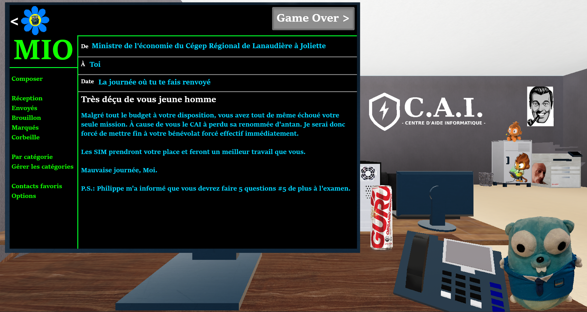 </td>
<td> 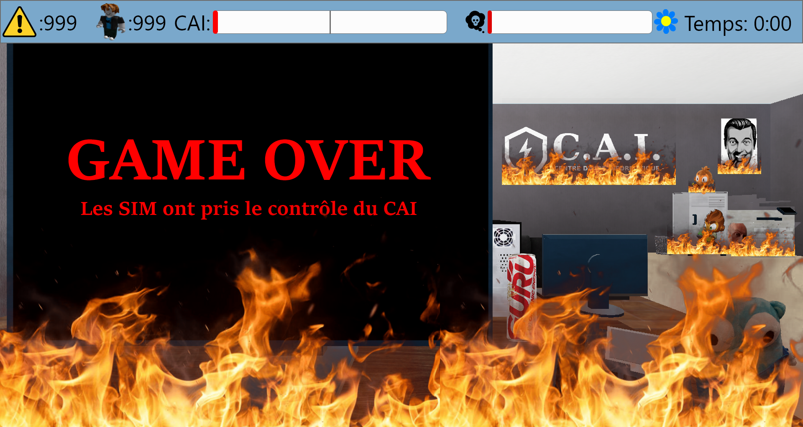 </td>
</tr></table>

**Après trois quart de travail perdu, le joueur se fait expulser de la cohorte et le jeu se termine.**

### Points d’expérience

Obtient de l’expérience, à chaque gain de niveau on obtient un point de compétence qu’on peut utiliser pour débloquer des bonus dans l’arbre de compétences qui aideront le joueur dans ses aventures.

# Compétences

Des arbres de compétences générales et spécifiques seront disponibles afin d'appliquer des améliorations et bénéfices.

## Générales

|Compétence |Étudiant|Stagiaire|Technicien|Benjamin|
|-----------|--------|---------|----------|--------|
|Déplacement|L’élève boit une boisson énergétique avant son quart de travail et se déplace légèrement plus vite pendant un certain temps.|Comme un bon élève, il a un meilleur cardio et peut donc courir.|Le joueur a trop de style en dépensant une fortune sur des souliers, il peut sauter sur les obstacles.|        |
|Odeur      |Installe un poster dans la classe qui rappelle aux personnes de mettre du déodorant et de prendre des douches afin de réduire les odeurs.|Le joueur dépense de l’argent à la COOP pour une bonne canette de Febreze pour réduire les odeurs plus rapidement.|L’administration peut enfin se permettre d’installer un ventilateur dans la classe.|Grâce à une subvention du gouvernement on peut se permettre de mettre un gros sapin sent bon dans la classe.|
|Temps      |        |L’étudiant envoie un MIO à Philippe pour avoir un extension de temps.|L’étudiant peut se concentrer grâce à de la lo-fi.|Le joueur est très relaxe et bénéficie de beaucoup de temps.|
|Réparation |        |Utilisation de Github plutôt que des documents word datant de 2003, lui permettant de réparer plus facilement.|Le joueur possède maintenant un marteau et peut réparer les objets.|L’élève a regardé des vidéos d’indiens sur Youtube lui permettant de comprendre plus rapidement comment réparer les objets.|

<table><tr>
<td> 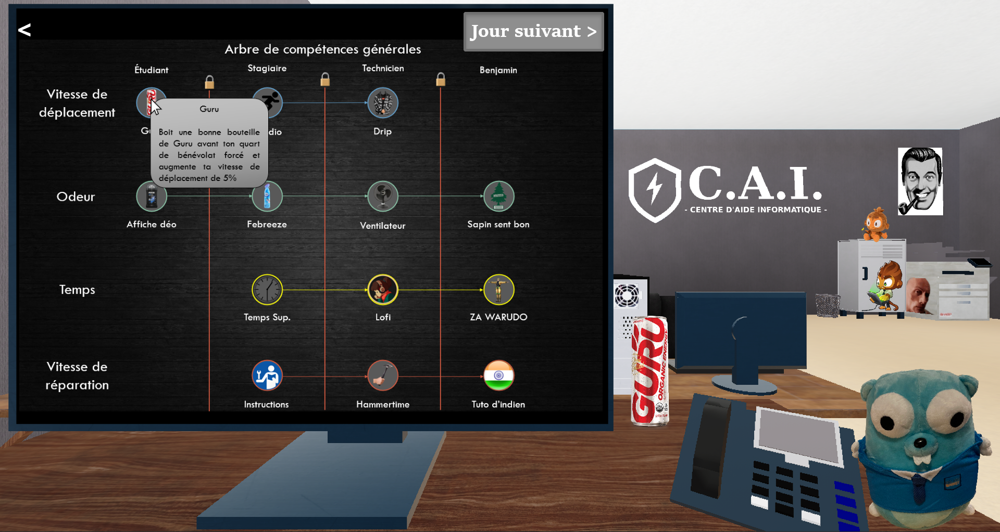 </td>
<td> 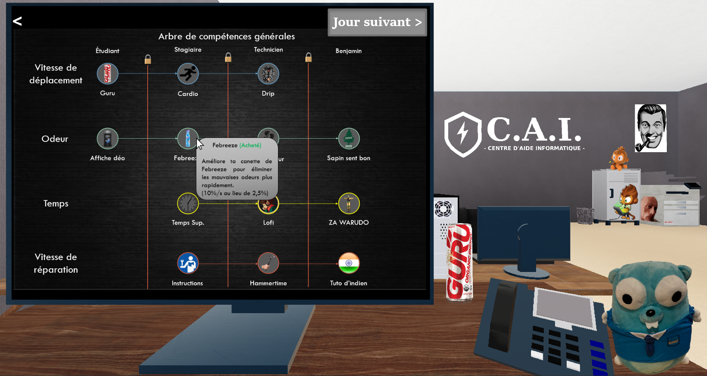 </td>
</tr></table>

# Mini-jeux

## Lancer des boulettes de papier

 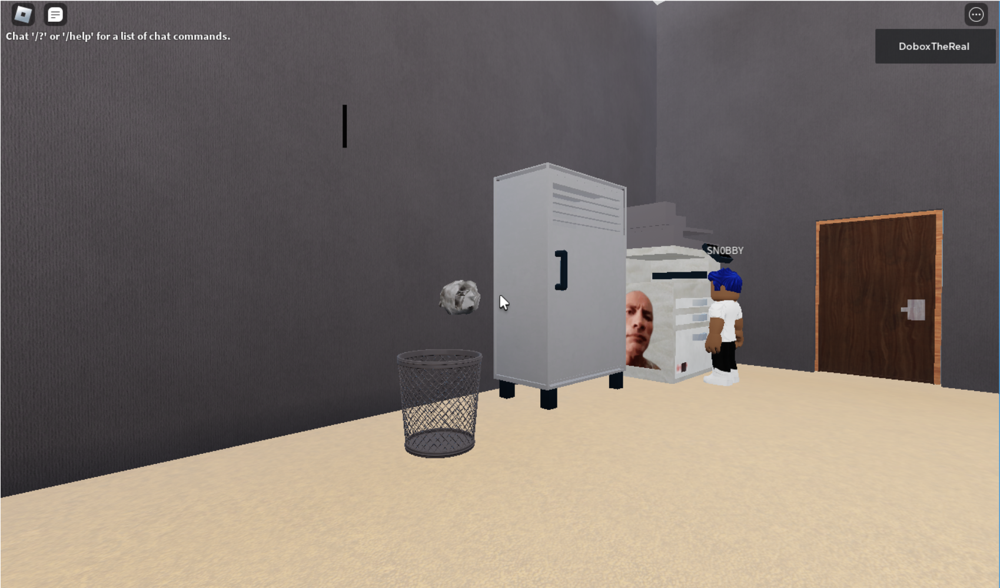

Un élève sans aucune connaissance en informatique à imprimé sont travail final de 60 pages 200 fois! C’est après avoir fait la gaffe qu’il te demande de l’aide. Tu dois alors lancer toutes les boules de papier dans la poubelle pour qu’il te laisse tranquille et dise à Philippe que tu fais du bon travail.

### Déroulement

Le joueur apparaît dans la bibliothèque avec une boule de papier à la main, il doit alors réussir X lancé dans la poubelle avec une limite de X lancer (dépendant de la difficulté). À chaque lancer réussi, la poubelle change de position dans une zone définie (dépendant encore de la difficulté).

Au niveau intermédiaire, des ventilateurs sont installés dans la pièce et modifient la trajectoire du lancer.

Au niveau difficile, des élèves ainsi que Philippe se déplacent dans la pièce et interceptent le lancer.

### Contrôles

- Mouvement de la souris -> Contrôle de l'angle
- Bouton de gauche de la souris -> Contrôle de la force

## Éviter des interventions

 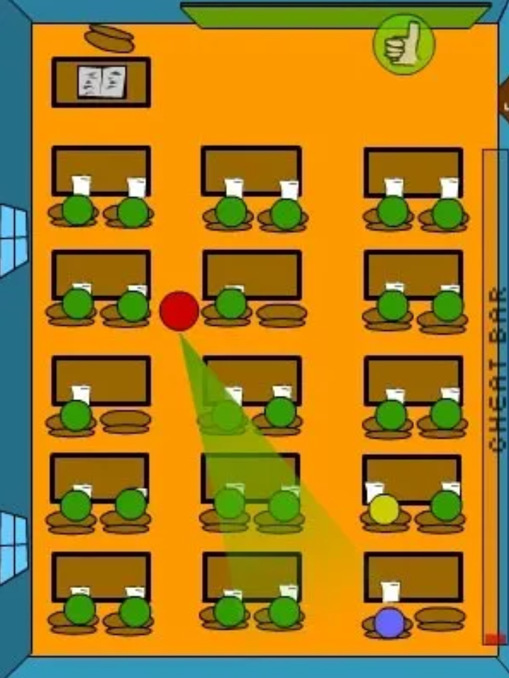

Vous n’avez pas assez de points pour passer votre quart de travail ? Vous avez encore plusieurs secondes de soutien informatique à faire mais vous voulez finir plus tôt et partir ? Deux problèmes, une seule solution : vous allez devoir fuir le local!

Le mini-jeu se déclenche automatiquement dans les 30 dernières secondes du quart de travail si le joueur n’a pas amassé assez de points pour obtenir la note de passage. Le joueur peut aussi activer le mini-jeu en cliquant sur la porte du local afin de terminer son quart de travail plus tôt.

### Déroulement

Vous commencez à votre bureau comme au début de votre quart de travail, mais cette fois, avec une vue à vol d’oiseau. Votre objectif est d’atteindre la porte sans vous faire repérer par Philippe et les élèves. Pour ce faire, vous devez éviter leurs champs de vision représentés par deux lignes formant un angle. Un nombre d’élèves aléatoires restent assis à leur place et se contentent de tourner la tête de temps en temps alors que Philippe, lui, se promène dans le local. Pour éviter leur regard, vous pouvez vous cacher derrière un meuble afin de couper leur champ de vision. Vous devez atteindre la porte en moins d’une minute sans vous faire repérer. Si Philippe vous repère, vous revenez à votre point de départ. Si un élève vous repère, le chronomètre s’accélère.

### Contrôles

- W -> Avancer
- A -> Aller à gauche
- S -> Reculer
- D -> Aller à droite

## Course sur chaise

 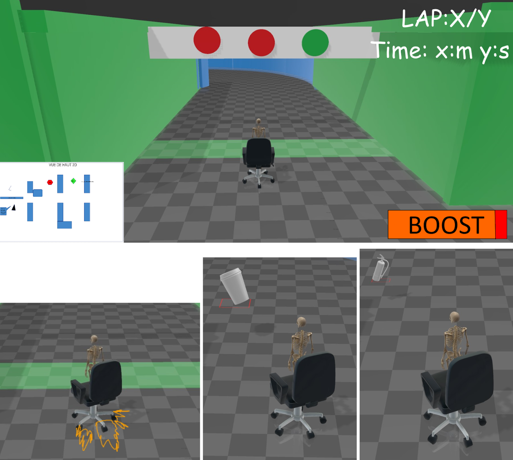

Un élève de SIM vient te voir pour te défier à la course de chaise à roulette. Il te dit que si tu perd il ira dire à Philippe que tu fais mal ton travail. L’élève de SIM, ayant des connaissances approfondies en physique et en mécanique, il est convaincu que vous n’allez pas battre son temps. Il est à toi de restaurer l’honneur des TI souillé par l'arrogance de ce SIM. Vous vous êtes muni d’une chaise de la salle d’informatique pour faire cette course. (Potentiellement un easter egg d’une chaise gaming (Modele B08PMYPKYP) caché dans le cégep pour remplacer la chaise de base)

### Déroulement

Circuit de chaise à roulettes entre les tables et les étagères de la bibliothèque. Effectuer le meilleur temps possible à la première personne. (!!Le nombre de tours devra être déterminé une fois que la map sera créée!!) La course commence avec des lumières de couleurs qui s'allument l’une à la suite de l’autre et la course commence au moment où celle verte allume (un bruit va se jouer à chaque fois qu’une lumière s’allume, mais celle du départ fait un bruit différent des autres). Durant la course, il y aura des objets qui seront placés sur le circuit pour donner un bonus. Il peut aussi y avoir des obstacles qui vont se dresser devant le chemin. Pour gagner la course, il faut faire le nombre de tours prédéterminés en traversant la ligne d’arrivée. À la fin de la course, si le joueur bat le temps que la personne du SIM nous à dit de battre et bien il gagne.

#### Obstacles

- Personnes
- Flaque de liquide

#### Bonus

- Extincteur -> Recharge la jauge de « boost »
- Boisson énergisante -> Amélioration du « boost »
- Librifiant -> Augmentation de la vitesse

### Contrôles

- W -> Accélérer
- A -> Tourner à gauche
- S -> Freiner
- D -> Tourner à droite
- Majuscule -> Utilisation du « boost »
- Espace -> Dérapage

## Lignes de commandes

 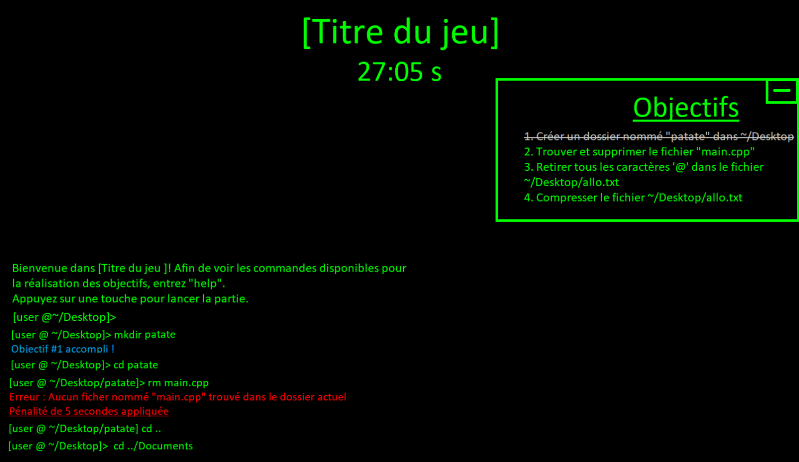

Un étudiant se tient debout à côté de son ordinateur et demande au joueur de l’aider avec celui-ci. Sa souris ne fonctionne plus, et le joueur est tenu d’utiliser le terminal afin de régler le problème.

### Déroulement

Le joueur est accueilli dans le terminal par un message lui affichant les objectifs à compléter avant la fin du chronomètre. Ces objectifs seront générés aléatoirements et pourraient être:

- Tuer un processus
- Compresser/décompresser un fichier avec tar
- Trouver un fichier dans une arborescence complexe
- Modifier le contenu d’un fichier
- Supprimer un fichier
- Créer un fichier
- Etc.

Le joueur pourra en tout temps entrer “help” afin de se remémorer les commandes disponibles.

À chaque erreur de l’utilisateur, du temps sera soustrait au chronomètre.

Un pointage sera attribué au joueur à la fin de la partie selon le temps qu’il restait au chronomètre à la fin de la partie.

## Architecture réseaux

 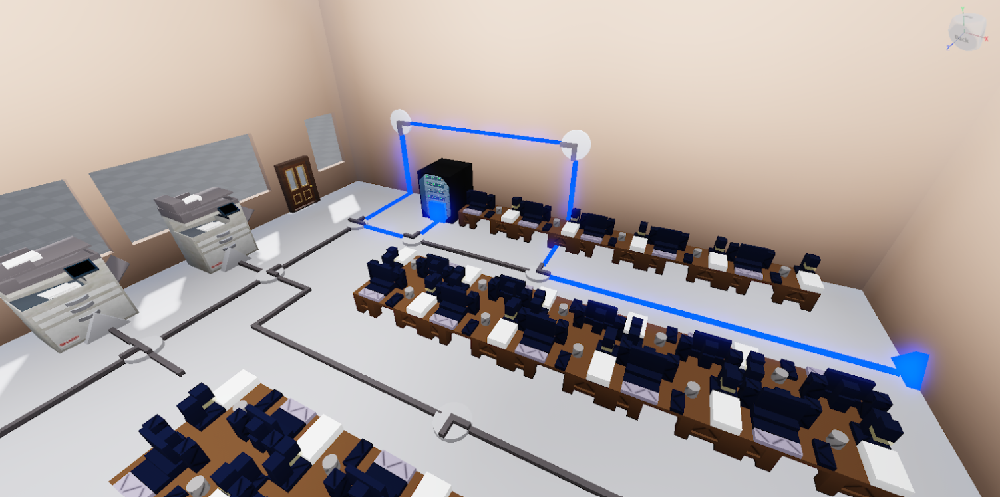

Une fois par shift environ, un élève (ou un SIM) va faire planter le réseau de la classe en branchant deux câbles ethernet sur le même port. À ce moment, le mini-jeu d’architecture réseau se déclenche. En cas de perte dans ce mini-jeu, tu es automatiquement éliminé de ton quart de travail.

### Déroulement

Lors de la mise hors tension du réseau, une petite fenêtre en haut à droite de l’écran apparaît pour indiquer au joueur qu’il a 30 secondes pour se rendre au routeur et activer le premier sous mini-jeu. Arriver à destination, la fenêtre du sous mini-jeu pour réparer le routeur apparaît. Il s’agira d’un labyrinthe où le joueur devra déplacer sa souris sans toucher aux murs de ce dernier pour arriver à la fin du labyrinthe et cliquer sur le bouton “enable”. Il aura 30 secondes pour y accéder, sinon il perd le mini-jeu. Lorsque le joueur touchera un mur, sa souris se remettra au point de départ.

Si le joueur réussit, la deuxième partie du mini-jeu débute avec le second sous mini-jeu. Il s’agira du jeu de casse-tête de connecteur de tuyaux/circuit électrique. Partout dans la classe, il y aura un circuit qui partira du routeur vers une imprimante ou un ordinateur. Dans ce circuit, il y aura des connecteurs mal positionnés qui empêchent le flux de données du réseau de se rendre à destination. Le joueur devra donc interagir avec ces connecteurs de ce réseau pour les positionner correctement pour faire en sorte que le flux qui part du routeur se rend à l’ordinateur ou l’imprimante. Parfois, certains connecteurs activeront un chronomètre lorsque le flux passera en eux. Le joueur devra donc se dépêcher à terminer le chemin avant que le temps soit écoulé. Aussi, certains connecteurs seront bloqués. Pour les débloquer, il faudra faire passer le flux sur plusieurs endroits de ce connecteurs pour le débloquer. Grâce à sa super vue activée automatiquement après le premier sous mini-jeu, le joueur pourra voir les circuits et les bouger au travers le plancher, le plafond et les murs. Lorsque le flux sera à destination, il devra cliquer sur le bouton de destination pour terminer et réussir le mini-jeu.

### Contrôles

- W -> Avancer
- A -> Aller à gauche
- S -> Reculer
- D -> Aller à droite
- Bouton de gauche de la souris -> Interaction

# Locaux

## Éléments des locaux

### Source de problème

Une source de problème est une place où un événement peut se produire. Par exemple, l’imprimante dans une salle est considérée comme une source de problème, car elle peut être endommagée.

Un événement est soit une interaction simple ou un mini-jeux.

### Poste de travail

Les postes de travail est un bureau qui consiste d’un moniteur, d’un ordinateur (situé sous le bureau), d’un clavier, d’une souris et d’une chaise. Lorsqu’un étudiant est inséré dans le jeu, il aura un poste attitré à lui. Un poste de travail occupé par un étudiant est considéré comme une <b>source de problème.</b>

Le nombre de postes de travail déterminera le nombre d’étudiants maximum qui peuvent avoir besoin d’aide (environ ½ des postes). 

### Objets réparable

Les objets réparables sont des <b>sources de problèmes</b>. L’objet n’est pas obligé d’être manipulé par un étudiant pour qu’il soit endommagé.

Voir réparations-simples pour plus d’exemple.

### Architecture réseaux

Chaque niveau devrait contenir au minimum un routeur qui servira comme <b>la base au jeu d’architecture réseau</b>. Cependant, il se peut qu’un niveau ait plusieurs objets qui servent comme base. Par exemple, la bibliothèque peut contenir un disjoncteur électrique (breaker).

### Bureau du joueur

Le bureau du joueur est la place où le joueur apparaît dans le niveau. C’est aussi la place où le joueur peut commencer le quart de travail.

### Sortie 

Le joueur peut décider de sortir du niveau si ça ne lui tente pas de faire le CAI. Dans ces scénarios, le jeu d'échappée sera déclenché.

## Bibliothèque

 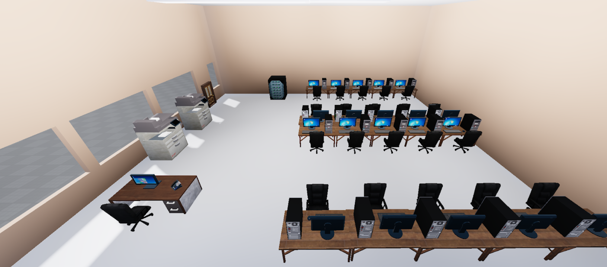

La bibliothèque, plus précisément le local d’informatique, est le niveau principal du jeu. Il possède: 

- 20 postes de travail
- Un bureau du CAI (bureau du joueur)
- Système d’odeur 
- Une imprimante et un scanner (objets réparables)

# Fonctionnalités

Les objets comme les routeurs, les imprimantes, les postes de travail peuvent nécessiter une réparation pendant un quart de travail. Ces réparations peuvent apparaître aléatoirement ou être une demande faite par les élèves dans la classe. Une notification visuel/auditif sera faite au joueur pour l’avertir des tâches à faire. Les réparations sont sous deux catégories: réparations simples et réparations complexes.

## Réparations simples

 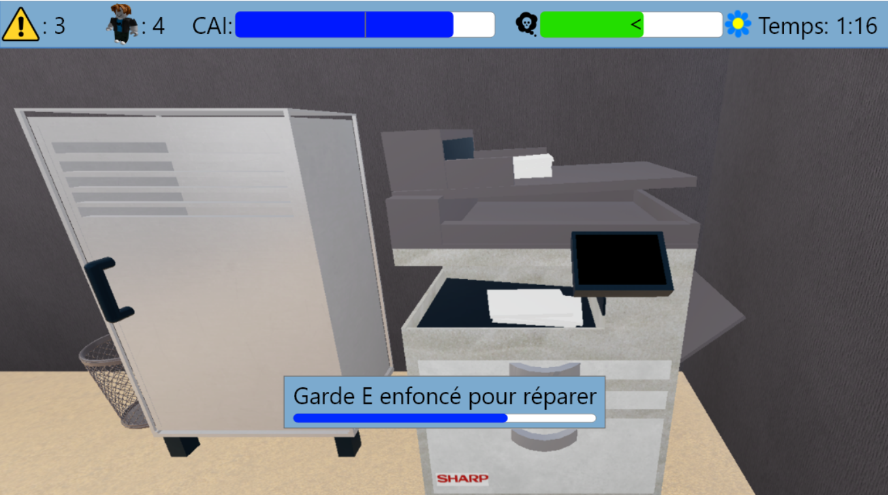

Une réparation simple nécessite aux joueurs de se rendre à l’objet endommagé et de tenir / peser / peser plusieurs fois le bouton d’interaction <b>(e)</b>. Ces causes d'endommagement peuvent être:

- Une imprimante qui manque de papier
- Un objet débranché/fermé/gelé/sale (routeur/imprimante/ordinateur/périphériques)
- Une flaque d’eau

La mécanique de réparation peut aussi être utilisé pour aider les gens qui ont des problèmes, par exemple:

- Un étudiant qui veut sortir de vim
- Un étudiant qui a un problème sur Omnivox
- Un étudiant qui ne peut pas se connecter au réseau sur son téléphone

Le temps de réparation peut être diminué par la compétence de <b>Vitesse de réparations</b>. 

## Réparations complexes

 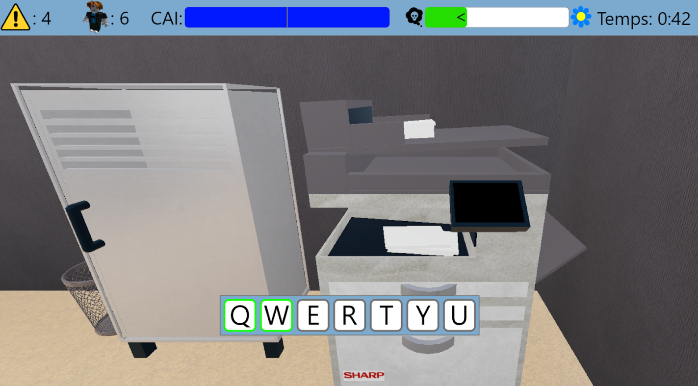

Une réparation complexe peut soit:

- Être une combinaison de plusieurs réparations simples
- Être un mini jeux (ligne de commandes, boulette de papier, cours chaise à roulette, architecture réseaux)

Les réparations complexes auront une priorité sur les réparations simples et donneront une plus grosse récompense à la jauge CAI.

 Les réparations seront soulignées par une icône

## Sauvegarde

À la fin d’un quart de travail, le jeu s’enregistre automatiquement.

Les données suivants sont sauvegarder:

- Les compétences débloqués
- Le # de quart de travail qu’il est rendu
- Les points d’expérience

Sur le menu principal, le joueur peut décider de recommencer à partir d’une sauvegarde. Lors d’un quart de travail, il peut décider de recommencer le quart, ce qui est en soit un chargement de l’ancienne sauvegarde.

## Système d'odeur

Certains niveaux auront un niveau d’odeur à gérer. Si l’odeur d’une pièce est trop élevée, elle va produire des effets négatifs au quart de travail. Le joueur peut diminuer l’odeur en utilisant des outils ou en achetant des compétences.

Des outils qui peuvent diminuer l’odeur de la pièce:

- Canette d’Axe
    - Débloquée de base, diminue un peu le niveau d’odeur. 
    - 2.5% par seconde
- Canette de Febreze
    - Débloquée par une compétence, diminue beaucoup le niveau d’odeur. 
    - 10% par seconde
- Affiche de déo
    - Débloquée par une compétence, diminue l’accumulation d'odeurs dans la pièce. 
    - prends 10% plus de temps
- Ventilateur
    - Débloqué par une compétence, diminue l’accumulation d’odeurs dans la pièce.
    - prends 25% plus de temps
- Sapin sent bon
    - Débloqué par une compétence, diminue l’accumulation d’odeurs dans la pièce et augmente le niveau de patience. 
    - prends 50% plus de temps, augmente le temps de patience par 10%

Si le joueur maintient une bonne odeur tout au long du quart de travail, il recevra un bonus à la fin de son quart de travail.

## Système de patience

Les élèves dans la classe auront tous une barre de patience qui se vide peu à peu tant que le joueur ne règle pas leur problème.

Quand la barre de patience est vide, l'élève partira de la classe et le joueur ne pourra plus accomplir sa tâche pour récolter des points CAI.

De plus, l’odeur dans la classe influencera la patience des élèves, plus que la classe pue, plus que les élèves sont impatients.

