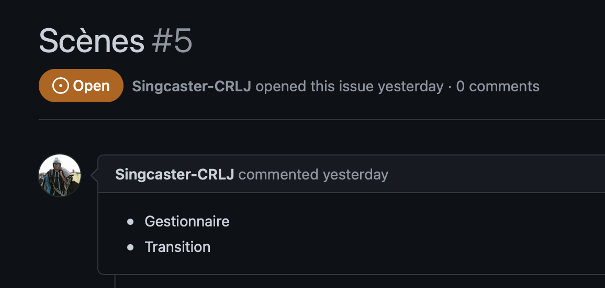

# Normes

## Normes de soumission

* Instruction d'install/build dans le `README.md`
* Faire un `git pull` avant de commencer à travailler
* Faire un `git pull` avant de faire un `git push`
* Lorsque vous avez terminé, faire un `git push`
* Avant de push, toujours faire un `git status -s` pour s'assurer que tout les fichiers sont ajoutés
* Aucun `git pull --rebase` ou `git push --force`
* Aucun `git commit --amend` sur un commit qui a déjà été pushé
* Les seuls commentaires présent devraient être descriptifs (pas de code en commentaire)
* Aucun print ou cout dans le code
* Aucun charactères illégaux (pas d'emoji, de charactère invisible, etc.)


## Comment initialiser Git dans un répertoire

1. Assurez vous que vous avez votre clé ssh enregistré pour votre compte github, dans les setting du compte
2. Aller dans le dossier ou vous voulez avoir le projet, assurez vous qu'il est sauvegardé en local
3. Ouvrez gitbash dans le dossier
4. `git clone git@github.com/Singcaster-CRLJ/TI2022.git`
5. Vous pouvez maintenant push et pull à partir du dossier qui a été créée


### Numéro d'issue

Pour voir le numéro d'issue, vous devez allez à l'issue que vous êtes assignés dans le sprint. Le numéro est écrit en gros à côté du fichier.



### Format de git commit message

* Une ligne de titre de 50 caractères ou moins
* Une description qui explique le commit, en incluant des exemples si nécessaire
* Le commit doit être en français
* Doit inclure un message qui dit si les fuites de mémoires ont été vérifié ou non

Checklist:
- [ ] Nom des fonctions ajoutés
- [ ] Nom des fonctions modifiés + description des modifications
- [ ] Nom des classes ajoutés
- [ ] Nom des classes modifiés + description des modifications
- [ ] Dépendences ajoutés et dans quel fichiers

La ligne titre a le format: "type: sujet (#issue)"

Exemple:

```text
Camera: Réparé bug que la caméra se coinçait dans un coin (#2)

La caméra se coinçait lorsqu'elle se collait à un coin trop petit.
Ajouté un modulo dans le calcul de collision pour éviter ceci.
```

Pour faire un commit:
```bash
git commit -am "title" -m "description"
```

Si, pour une raison quelconque, vous avez ouvert vim, vous pouvez quitter en appuyant sur `ESC` puis `:q!` puis `ENTER`.

Pour nano, vous pouvez quitter en appuyant sur `CTRL+X` puis `y` puis `ENTER`.

## Normes de programmation

### Utilisation
* Auto: Seulement dans des cas ou le type est déjà défini
  * Exemple: `auto *texture = new Texture();`
  * `for(auto texture : textures)`

### Façon d'écrire
* Nom de variable: significatif, mais pas de prefix
  * Exemple: `int textureId;`
* Variables: camelCase
  * Exemple: `int nomDeVariable;`
* Classes: PascalCase
  * Exemple: `class NomDeClasse{};`
* Méthodes: camelCase
  * Exemple: `void nomDeMethode(){};`
* Fichiers: Nom de la classe (PascalCase)
  * Exemple: `NomDeClasse.hpp`
* Pointeurs: `Type *nom`
  * Exemple: `int *examplePointeur;`

### Accolades
* Placement d'accolades après
    * Pour les if/else, le else est en dessous de l'accolade

### Ordre
* Pragma once
* Class order
  * Private
    * Variables
    * Methods
  * Public
    * Variables
    * Constructor
    * Destructor
    * Statiques
    * Methods
    * Get
    * Set

### Ordres des choses
* Tous les propriétés doivent être en ordre
  * x, y, z
  * width, height
  * min, max

### Includes
* `#pragma once` dans tous les classes
* Include des librairies de C++ avec `<library>`
* Include des librairies de notre projet avec `"library.hpp"`

* Fichiers: .hpp
* Enum: PascalCase, valeurs en FULL_CAPS
* Defines : FULL_CAPS

### Aeration
  * Une ligne après un groupe de choses
    * Exemple: déclaration de variables,
    * après un if/else/loop
* Tabulation: 4 espaces

### Example de code
```cpp
/// @file main.cpp
/// @brief Point d'entrée de l'application
/// @author Jean-Philippe <me\@darkh.app>
#pragma once

#include <iostream>
#include <vector>

#include "SomeLibrary.hpp"
#include "SomeOtherLibrary.hpp"

using std::cout;
using std::endl;

enum CardinalDirection {
    NORTH,
    SOUTH,
    EAST,
    WEST
}

/// @class SomeClass
/// @brief Une classe qui fait des choses
class SomeClass {
private:
    int someVariable;      ///< Une variable
    int someOtherVariable; ///< Une autre variable

public:
    SomeClass() {}

    /// @param baseParameter Un paramètre à recevoir
    SomeClass(int baseParameter) {
        someVariable = baseParameter;
    }

    void doSomethingWacky() {
        cout << "uwu" << endl;
    }

    /// @brief Retourne une variable
    /// @return Une variable
    int getVariable() {
        return someVariable;
    }
}

int main() {
    vector<SomeClass> someClasses;
    SomeClass *wacky = new SomeClass();
    SomeClass somethingElse;
    CardinalDirection direction = CardinalDirection::SOUTH;

    // Un commentaire utile
    if (wacky->getVariable() > 0) {
        // TODO: implement more things
    } 
    // Un commentaire très très long avec tellement de
    // truc très utiles et cool.
    else {
        // TODO: faire des trucs
        direction = CardinalDirection::NORTH;
    }

    for(int i = 0; i < 10; i++) {
        cout << "uwu" << endl;
    }

    for(auto someClass : someClasses) {
        someClass.doSomethingWacky();
    }

    int variable = wacky->getVariable() > 5 ? 100 : 0;

    return 0;
}

```

## Normes de texturarisation

### Textures
* PNG
* depth: 32 bit
* Maximum de 2000x2000
* format RGBA
