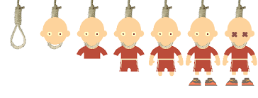

# TP 2

Pour le TP2, vous aurez à compléter un bonhomme pendu.

Vous devez utiliser des images libre de droit

## Description
Un mot caché est affiché avec des _ représentant le nombre de lettre du mot.

Toutes les lettres de l'alphabet sont offertes au bas de l'écran, l'utilisateur choisit une lettre.

* Si la lettre est présente dans le mot caché, toutes les occurences de la lettre sont affichées.

* Si la lettre n'est pas présente dans le mot caché, un perd un essai.

Après 6 essais, on perd la partie. Si vous trouvez le mot, votre nom peut être inscrit dans le Hall of Fame en fonction du nombre d'essai manqué.

# API

adresse : https://bonhomme.drynish.duckdns.org/

## getWord

retourne un json contenant un mot et un secret

## solveWord($secret, $player, $score) 

vous envoyez le nom du joueur et le score au mot représenté par le codage secret

Exemple:

https://bonhomme.drynish.duckdns.org/solveWord/kfdajlkfdjalfkfad34/michel/3

## highScore($word)

vous obtenez la liste des high scores pour un mot

Exemple: 

https://bonhomme.drynish.duckdns.org/highScore/nombril

#  Interface

Vous pouvez utiliser les StoryBoards ou SWiftUI pour la remise.

## Partie 

Au début de la partie, on affiche l'utilisateur ayant trouvé le mot avec le moins de tentatives.

## HighScore

Permet de voir le HighScore de tous les mots de la bd. On offre une case qui permet d'afficher les highscores.

# Barème de correction
| Nom                                | Note |
| ---------------------------------- | ---- |
| Jeu                                | /5   |
| API (Connection, obtention du mot) | /5   |
| ViewModel                          | /5   |
| HighScore                          | /5   |
| Qualité du code                    | /10  |
| **Total**                          | /30  |
